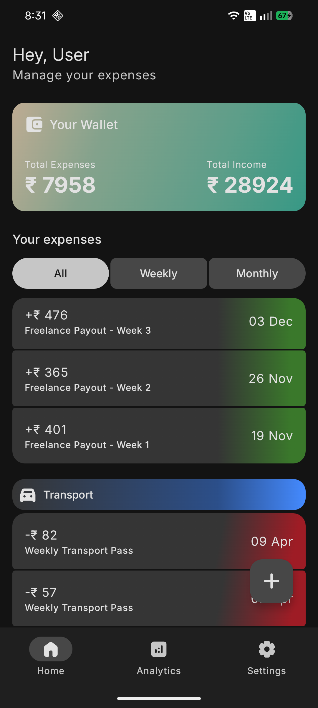
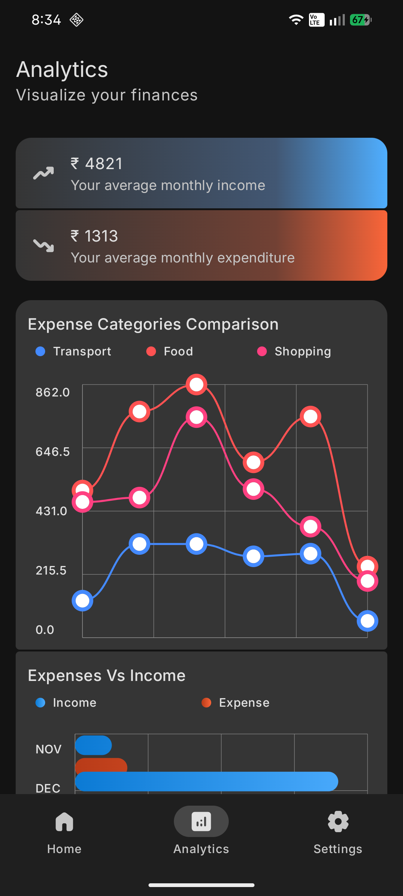
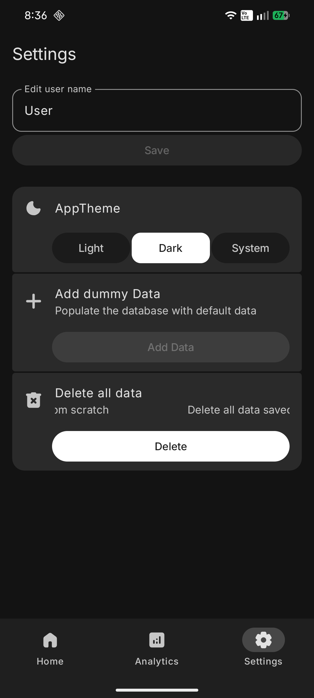
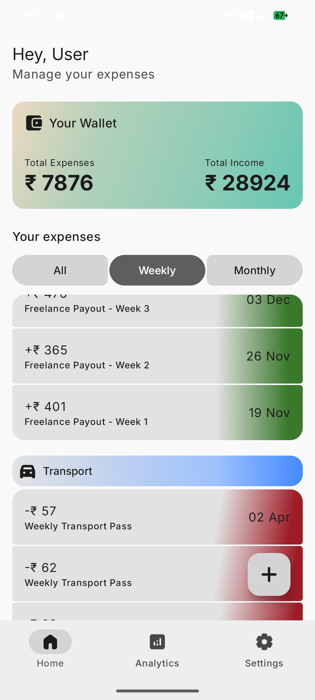
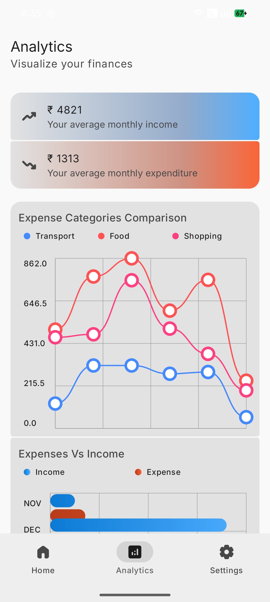
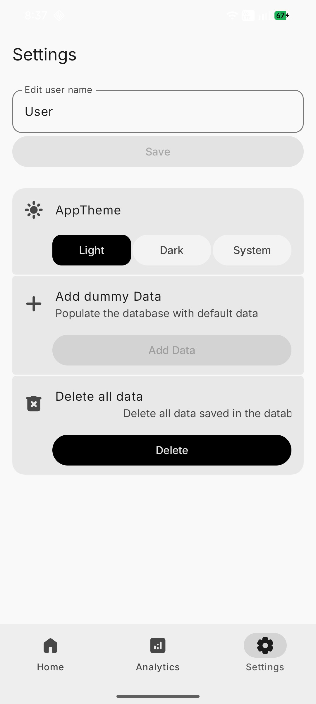
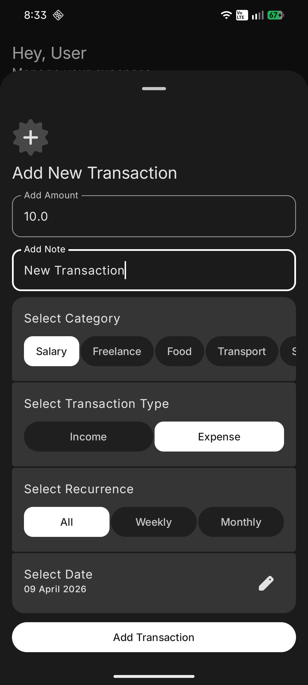
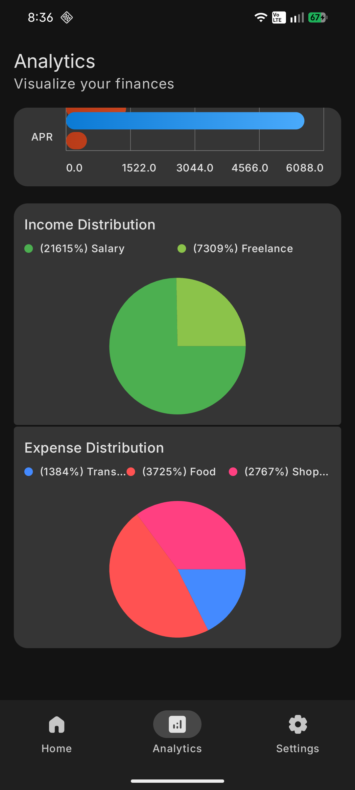
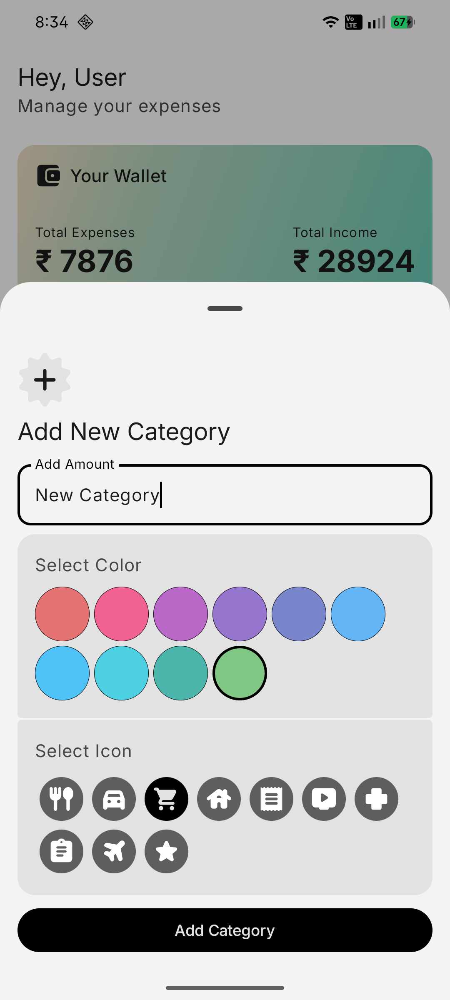
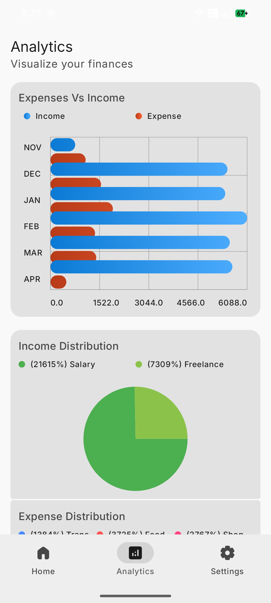

# PennyPal

Finance Manager app, Part of TUF Assignment. Made with Kotlin Multiplatform targeting Android and iOS
Sharing 100% UI and business logic.

## Screenshots

|          Home Page          |          Analytics Page          |          Settings Page          |
|:---------------------------:|:--------------------------------:|:-------------------------------:|
|  |  |  |
|  |  |  |
|  |  |                                 |
|  |  |                                 |

## Feature List
- Add Transactions (Income/Expenses)
- Total Expenses/Income
- Average Monthly Income/Expenses
- Monthly Comparison between Expenses of different Categories
- Monthly Income Vs Expenses Comparison
- Pie Chart for Income/Expense distribution

## Setup Instructions

### Prerequisites
- JDK 17 or higher
- Android Studio (latest stable version recommended)
- Xcode (for iOS builds, macOS only)

### Android
You can open the project in Android Studio and build it from there or build it from the terminal:
```shell
./gradlew :androidApp:assembleDebug
```

### iOS

> ![NOTE]
> Not tested on iOS since I don't have a Macbook, which is required to build iOS apps

To build and run the iOS application, you will need a Mac with Xcode installed.

#### Using Xcode
1. Navigate to the `iosApp` directory.
2. Open `iosApp.xcodeproj` in Xcode.
3. Select a simulator or a connected iOS device.
4. Click the **Run** button (or press `Cmd + R`).

#### Using Terminal
You can also run the iOS application directly from the terminal using the following command:
```shell
./gradlew :composeApp:iosSimulatorArm64Run
```
